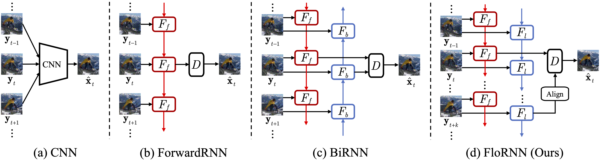

# Unidirectional Video Denoising by Mimicking Backward Recurrent Modules with Look-ahead Forward Ones
This source code for our paper "Unidirectional Video Denoising by Mimicking Backward Recurrent Modules with Look-ahead Forward Ones" (ECCV 2022)


## Usage
### Dependencies
You can create a conda environment with all the dependencies by running

```conda env create -f requirements.yaml -n <env_name>```

### Datasets
For synthetic gaussian noise, [DAVIS-2017-trainval-480p](https://data.vision.ee.ethz.ch/csergi/share/davis/DAVIS-2017-trainval-480p.zip) dataset is used for training,
[DAVIS-2017-test-dev-480p](https://data.vision.ee.ethz.ch/csergi/share/davis/DAVIS-2017-test-dev-480p.zip) and [Set8](https://www.dropbox.com/sh/20n4cscqkqsfgoj/AABGftyJuJDwuCLGczL-fKvBa/test_sequences?dl=0&subfolder_nav_tracking=1) are used for testing.
For real world raw noise, [CRVD](https://github.com/cao-cong/RViDeNet#captured-raw-video-denoising-dataset-crvd-dataset) dataset is used for training and testing.

### Testing
Download pretrained models from [Google Drive](https://drive.google.com/drive/folders/1A854tOA6_qB14ax3JZ7bb7tLo0UovkyI?usp=sharing) or [Baidu Netdisk](https://pan.baidu.com/s/1YomcegvdtoxVPr96odCo8w?pwd=ogua).
We also provide denoised results (tractor from DAVIS-2017-test-dev-480p) for visual comparison.
1. For synthetic gaussian noise,
```
cd test_models
python sRGB_test.py \
    --model_file <path to model file> \
    --test_path <path to test dataset>
```
2. For real world raw noise, 
```
cd test_models
python CRVD_test.py \
    --model_file <path to model file> \
    --test_path <path to CRVD dataset>
```

### Training
1. For synthetic gaussian noise,
```
cd train_models
python sRGB_train.py \
    --trainset_dir <path to train dataset> \
    --valset_dir <path to validation set> \
    --log_dir <path to log dir>
```
2. For real world raw noise,
```
cd train_models
python CRVD_train.py \
    --CRVD_dir <path to CRVD dataset> \
    --log_dir <path to log dir>
```
3. For distributed training of synthetic gaussian noise,
```
cd train_models
python -m torch.distributed.launch --nproc_per_node=4 sRGB_train_distributed.py \
    --trainset_dir <path to train dataset> \
    --valset_dir <path to validation set> \
    --log_dir <path to log dir>
```

## Citation

If you find our work useful in your research or publication, please cite:
```
@article{li2022unidirectional,
  title={Unidirectional Video Denoising by Mimicking Backward Recurrent Modules with Look-ahead Forward Ones},
  author={Li, Junyi and Wu, Xiaohe and Niu, Zhenxing and Zuo, Wangmeng},
  booktitle={ECCV},
  year={2022}
}
```
